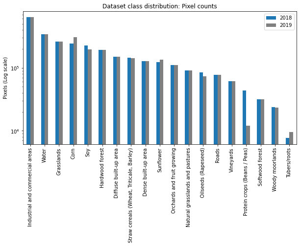

# Dataset distribution information

## Number of samples per year

| Year       | samples |     |
| ---------- | ------- | --- |
| 2018       | 62343   |     |
| 2019       | 48560   |     |
| Difference | 13783   |     |

## Class distribution per year (polygon-level)

## Class distribution per year (pixels-level)

## Dataset pixel-based confusion matrix between 2018 and 2019

## Grid split

## Runtime comparison result

|                       | Direct reading (mins)    | Npz commpression and Loading (mins) |
| --------------------- | ------------------------ | ----------------------------------- |
| Appending             | 35.489                   | - read and append: 35.841           |
|                       |                          | - Npz compression: 7.527            |
|                       |                          | - loading: 60 sec                   |
| Matrix Initialization | To get L and N: 3.017    | To get L and N: 3.014               |
|                       | read into matrix: 35.488 | read into matrix: 35.442            |
|                       |                          | Npz compression: 6.616              |
|                       |                          | Loading: 85 sec                     |
